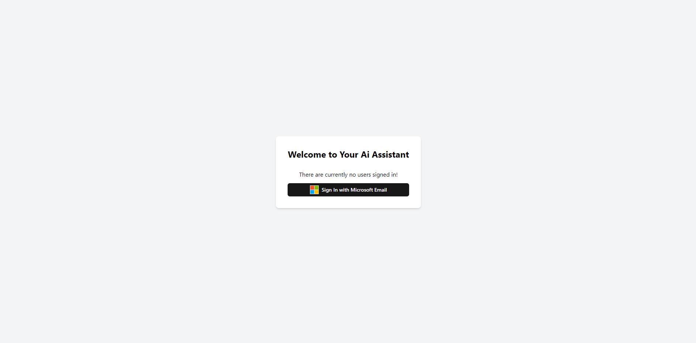
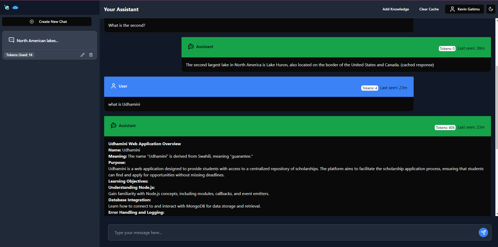
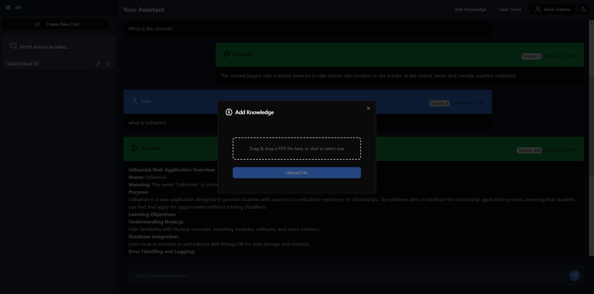
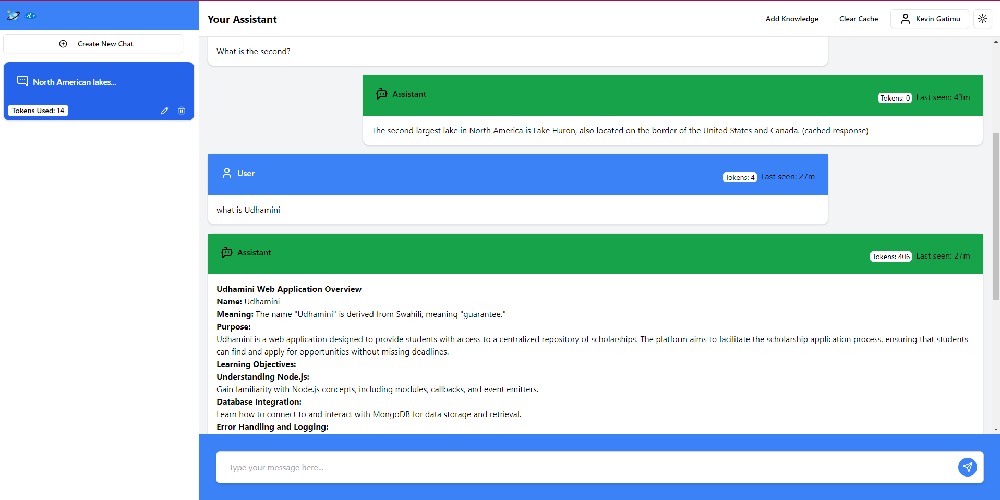
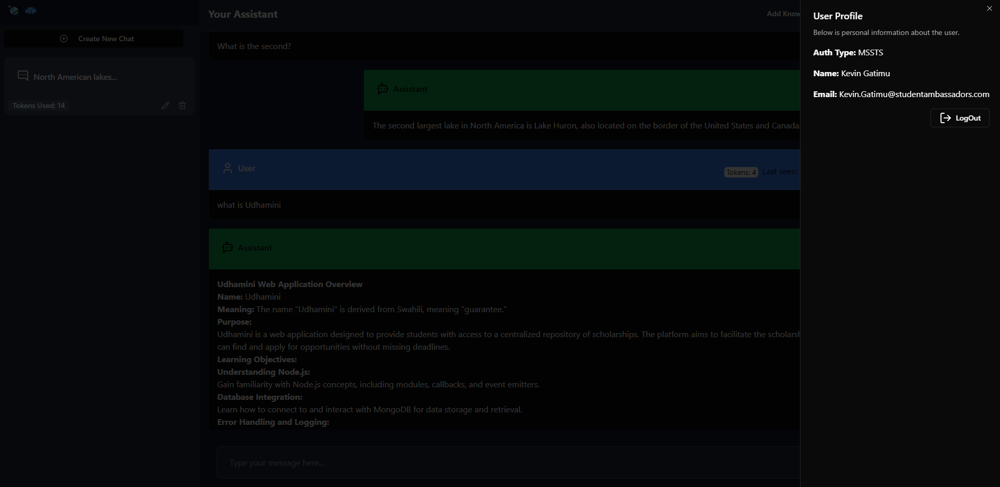

# Build a Copilot app using Azure Cosmos DB & Azure OpenAI Service

This sample application shows how to build a Generative-AI application using Azure Cosmos DB using its new vector search capabilities and Azure OpenAI Service and Semantic Kernel. The sample provides practical guidance on many concepts you will need to design and build these types of applications.

---

## User Experience
- SignUp

- Homepage

- Add Knowlege

- Light Theme

- User Profile


## Application Auth

This application is a React-based frontend that integrates with Microsoft Authentication Library (MSAL) to provide authentication using Microsoft Identity Platform (formerly known as Azure Active Directory). The application demonstrates how to sign in users and redirect authenticated users to the home page.

## Concepts Covered
This application demonstrates the following concepts and how to implement them:

The basics of building a highly scalable Generative-AI chat application using Azure Cosmos DB for NoSQL.
- Generating completions and embeddings using Azure OpenAI Service.
- Managing a context window (chat history) for natural conversational - - - - interactions with an LLM.
- Manage token consumption and payload sizes for Azure OpenAI Service requests.
- Building a semantic cache using Azure Cosmos DB for NoSQL vector search for improved performance and cost.
- Using the Semantic Kernel SDK for completion and embeddings generation.

## Prerequisites

Before running this application, you need:

- **Node.js version >= 20** installed. You can download it [here](https://nodejs.org/).
- An **Azure account**. If you don't have an Azure account, you can create a free one [here](https://azure.microsoft.com/free/).
- Subscription access to Azure OpenAI service. Start [here](https://learn.microsoft.com/legal/cognitive-services/openai/limited-access?WT.mc_id=studentamb_225706) to Request Access to Azure OpenAI Service
- VS Code, GitHub Codespaces or another editor to edit or view the source for this sample.
- Azure Cosmos DB for NoSQL Vector Search Preview enrollment
- Azure Blob Storage

## Cloning and Running the Application

### Step 1: Clone the repository

First, you need to clone the repository to your local machine.

```bash
git clone https://github.com/AzureCosmosDB/cosmosdb-nosql-copilot-javascript
cd cosmosdb-nosql-copilot-javascript
```

### Step 2: Register the Application on Microsoft Identity Platform

Before running the app, you'll need to register the application with the Microsoft Identity Platform to authenticate users via MSAL. Follow these steps:

1. **Log into Azure Portal**:
   - Go to [Azure Portal](https://portal.azure.com/).
   
2. **Navigate to Azure Active Directory**:
   - In the left-hand navigation pane, select **Microsoft Entra ID**.

3. **Click Add Button**:
   - In the dropdown select **App registration**.
   - Fill in the required fields:
     - **Name**: Give your app a meaningful name, e.g., `My MSAL React App`.
     - **Supported account types**: Choose an option that fits your scenario (e.g., **Accounts in any organizational directory and personal Microsoft accounts**).
     - **Redirect URI**: 
       - For authentication with React, the redirect URI should be of type **Single-page application (SPA)**.
       - Set it to `https://localhost:5173`, as this is the default port when you run the app locally.

4. **Configure API permissions**:
   - In the **API permissions** section, add the following:
     - By default, you will have **Microsoft Graph API permissions** enabled with  User.Read Permissions.
     - This is permission is enough for this demo.

5. **Client ID and Tenant ID**:
   - After registration, you will be redirected to your app's **Overview** page.
   - Copy the **Application (client) ID** and **Directory (tenant) ID**, as these will be required in your code.

6. **Configure authentication settings**:
   - Go to **Authentication** in the left-hand menu.
   - Under **Platform configurations**, make sure that the SPA is added and `https://localhost:5173` is listed as a **Redirect URI**.
   - Enable **ID tokens** under **Implicit grant and hybrid flows**.

7. **Create a `.env`** file in the root directory and configure your MSAL credentials:

```bash
VITE_CLIENT_ID=your-client-id
```

Replace `your-client-id` with the values you obtained from the Azure portal.


### Step 3: Quickstart

Please see [Quickstarts](./QUICK_START.md)


The application should now be running at [http://localhost:5173](http://localhost:5173).

## Key Features

- **Login**: Users can sign in using their Microsoft account via the MSAL authentication.
- **Redirect on Login**: After successful login, users are redirected to the home page.
- **Handling Login Progress**: If the login is in progress, users will be notified with a loading message.


## Additional Resources

- [MSAL.js Documentation](https://docs.microsoft.com/en-us/azure/active-directory/develop/msal-overview)
- [Azure Portal](https://portal.azure.com/)
- [React Documentation](https://react.dev/learn)

## License

This project is licensed under the MIT License - see the [LICENSE](LICENSE) file for details.

This README provides clear instructions to clone, configure, and run the application, as well as the steps for registering the app in the Microsoft Identity Platform for authentication.